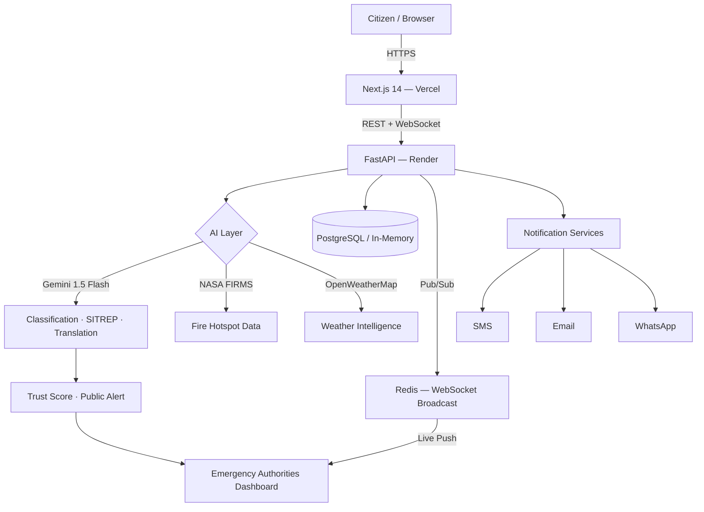
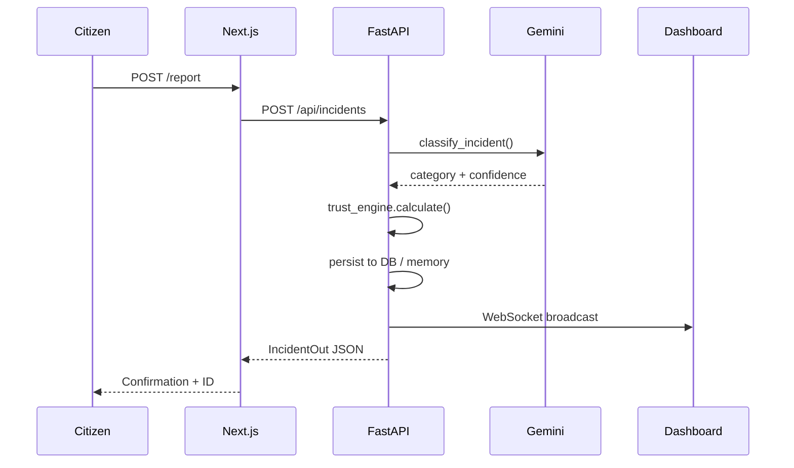
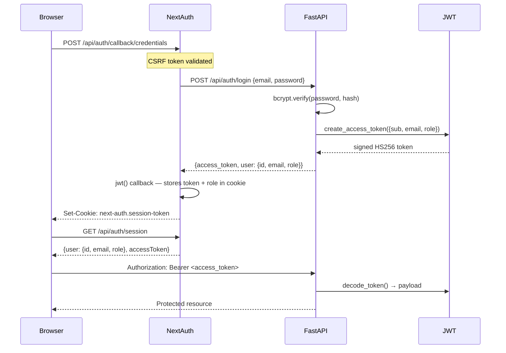
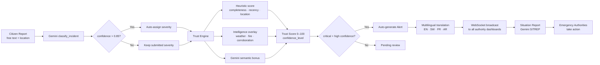

<div align="center">


# Sentinel AI — Community ActionGrid

**Real-time disaster intelligence platform. Citizens report. AI classifies. Authorities act.**

[](LICENSE)
[](https://python.org)
[](https://fastapi.tiangolo.com)
[](https://nextjs.org)
[](https://typescriptlang.org)
[](https://aistudio.google.com)
[](https://sentinel-ai-six-omega.vercel.app)

<br/>

[**Live Demo**](https://sentinel-ai-six-omega.vercel.app) &nbsp;·&nbsp;
[**Backend API**](https://sentinel-ai-2uo3.onrender.com/docs) &nbsp;·&nbsp;
[**Report Incident**](https://sentinel-ai-six-omega.vercel.app/report) &nbsp;·&nbsp;
[**GitHub**](https://github.com/fokrulanthro16-eng/sentinel-ai)

</div>

---

## Overview

Sentinel AI is an end-to-end emergency management platform that connects citizens, AI, and authorities in a single operational loop. When disaster strikes, every second counts. Traditional emergency reporting chains are slow, fragmented, and siloed. Sentinel AI collapses that chain.

**Who uses it:**
- **Citizens** submit incident reports from any device — no app install required
- **Emergency authorities** monitor a live command dashboard with AI-generated situation reports
- **Relief coordinators** track shelter capacity, rescue teams, and medical resources in real time

**What it solves:**
- Manual incident triage is too slow for fast-moving disasters
- Public alerts lose context and accuracy in translation across languages
- Authorities lack a unified operational picture — incidents, resources, weather, and risk in one view

**How it works:**
1. A citizen submits a flood report from their phone
2. Gemini AI classifies the incident, calculates a trust score, and generates an action recommendation
3. Authorities see the incident appear live on the command dashboard via WebSocket
4. If severity is critical and trust is high, an alert is auto-generated and broadcast in English, Swahili, French, and Arabic
5. Coordinators assign nearby resources — shelters, rescue teams, medical units — from the same interface

The entire stack runs without a database for zero-config demos. Drop in a PostgreSQL URL to go production-grade instantly.

---

## Features

### Emergency Management

- **Incident reporting** — structured form with GPS coordinates, severity, category, and media upload
- **Live command dashboard** — real-time stats, severity breakdown, active alert count, shelter status
- **Interactive risk map** — Leaflet map with incident pins, severity filters, and cluster heatmap
- **WebSocket broadcasts** — every incident creation and status change pushes to all connected dashboards instantly
- **Trust engine** — algorithmic incident confidence scoring using corroborating reports, weather data, and satellite fire hotspots
- **Audit trail** — every trust override and status change is logged with actor, timestamp, and reason

### AI (Gemini 1.5 Flash)

- **Incident classification** — free-text description → structured category + severity + confidence score
- **Situation reports (SITREP)** — executive-level risk summaries with priority action list and city-wide assessment
- **Multilingual alerts** — auto-translate public alerts into Swahili, French, and Arabic
- **Semantic trust scoring** — Gemini validates incident plausibility against nearby reports and sensor data
- **Configurable AI provider** — swap models and parameters via the admin AI settings panel without redeployment

### Resource Management

- **Shelters** — capacity, occupancy, coordinates, contact information
- **Rescue teams** — deployment status and location
- **Medical resources** — inventory levels and nearest-available routing (`/api/resources/nearest`)
- **Resource demand forecasting** — predictive model for resource shortfalls based on incident trends

### Analytics

- **Incident trends** — daily / weekly / monthly breakdowns by type and severity
- **Hotspot clustering** — geographic clustering of high-frequency incident coordinates
- **Risk timeline** — 3–30 day rolling risk score with trend direction
- **Response time analysis** — mean time-to-verify and time-to-resolve per incident category
- **Executive briefing** — AI-generated management summary combining all analytics signals
- **Shelter demand forecast** — projected occupancy against available capacity

### Notifications

- **SMS** — via configurable SMS gateway (mock mode when key absent)
- **Email** — SMTP-based alert distribution (mock mode when credentials absent)
- **WhatsApp** — WhatsApp Cloud API integration (mock mode when token absent)

---

## Screenshots

### Landing Dashboard


### Command Dashboard


### Live Risk Map


### Incident Submission Form


### AI Situation Report (SITREP)


### Analytics Dashboard


### Admin Panel — Incident Management


### Resource Management


---

## Architecture



### Request Flow



---

## Tech Stack

### Frontend

| Technology | Version | Purpose |
|---|---|---|
| Next.js | 14 (App Router) | SSR, routing, API routes |
| TypeScript | 5.x | Type safety |
| Tailwind CSS | 3.x | Utility-first styling |
| shadcn/ui | latest | Component library |
| NextAuth | v4 | Authentication + session management |
| Leaflet + react-leaflet | 1.9 / 4.x | Interactive risk maps |
| React Hook Form + Zod | 7.x / 3.x | Form validation |
| Prisma | 5.x | Optional user table ORM |
| Sonner | 1.x | Toast notifications |

### Backend

| Technology | Version | Purpose |
|---|---|---|
| FastAPI | 0.104+ | Async REST API + WebSocket |
| Pydantic v2 | 2.5+ | Schema validation |
| SQLAlchemy | 2.0 (async) | ORM — PostgreSQL |
| Alembic | 1.13+ | Database migrations |
| python-jose | 3.x | JWT signing (HS256) |
| bcrypt | 3.x | Password hashing |
| slowapi | 0.1.9 | Rate limiting |
| asyncpg | 0.29+ | Async PostgreSQL driver |

### AI & Intelligence

| Service | Purpose | Fallback |
|---|---|---|
| Google Gemini 1.5 Flash | Classification, SITREP, translation | Rich mock responses |
| OpenWeatherMap API | Real-time weather for trust scoring | Mock weather data |
| NASA FIRMS API | Satellite fire hotspot detection | Empty hotspot list |
| NASA POWER | Solar / climate data (free, no key) | Built-in |

### Deployment & DevOps

| Layer | Platform |
|---|---|
| Frontend | Vercel (serverless, auto-deploy on push) |
| Backend | Render (web service, auto-deploy on push) |
| Database | PostgreSQL (Render / Neon / Supabase) or in-memory |
| WebSocket relay | Redis (optional — falls back to in-memory) |
| Container | Docker + docker-compose (local / self-hosted) |
| CI/CD | GitHub → Vercel + Render auto-deploy |

---

## Folder Structure

```
sentinel-ai/
│
├── frontend/                        # Next.js 14 application
│   ├── src/
│   │   ├── app/                     # App Router pages
│   │   │   ├── (protected)/         # Route group — requires auth
│   │   │   │   ├── admin/           # Admin panel (ADMIN role)
│   │   │   │   │   ├── page.tsx     # Admin overview
│   │   │   │   │   ├── incidents/   # Incident management table
│   │   │   │   │   ├── resources/   # Resource management
│   │   │   │   │   └── ai-settings/ # AI model configuration
│   │   │   │   └── user-dashboard/  # Authenticated user home
│   │   │   ├── api/
│   │   │   │   └── auth/            # NextAuth handler + register proxy
│   │   │   ├── auth/                # Login + register pages
│   │   │   ├── dashboard/           # Public command dashboard
│   │   │   ├── map/                 # Full-screen risk map
│   │   │   ├── report/              # Incident submission form
│   │   │   ├── ai-summary/          # Gemini SITREP view
│   │   │   ├── analytics/           # Analytics dashboard
│   │   │   ├── alerts/              # Public alert feed
│   │   │   ├── resources/           # Resource browser
│   │   │   └── incidents/[id]/      # Incident detail + print view
│   │   ├── components/
│   │   │   ├── dashboard/           # StatsCard, IncidentTable, AlertsFeed, RiskSummary
│   │   │   ├── map/                 # RiskMap (Leaflet — client-only)
│   │   │   ├── shared/              # Navbar, ShelterPanel, Footer
│   │   │   └── ui/                  # shadcn/ui primitives
│   │   ├── lib/
│   │   │   ├── auth.ts              # NextAuth config — delegates to FastAPI
│   │   │   ├── api.ts               # Typed API client with mock fallbacks
│   │   │   └── mock-data.ts         # Demo dataset (8 incidents, 4 alerts, 5 shelters)
│   │   ├── contexts/                # React context providers
│   │   ├── types/                   # Shared TypeScript interfaces
│   │   └── middleware.ts            # Route protection — withAuth
│   ├── prisma/                      # Prisma schema + migrations (optional)
│   ├── public/                      # Static assets, PWA manifest, service worker
│   └── scripts/                     # Build hooks
│
├── backend/                         # FastAPI application
│   └── app/
│       ├── main.py                  # Entry point — CORS, middleware, lifespan
│       ├── api/routes/
│       │   ├── auth.py              # Register + login + /me
│       │   ├── incidents.py         # Incidents CRUD + trust engine
│       │   ├── alerts.py            # Alert management
│       │   ├── resources.py         # Resources + shelters
│       │   ├── ai.py                # Gemini endpoints
│       │   ├── ai_settings.py       # AI provider config
│       │   ├── analytics.py         # Trends, hotspots, forecasting
│       │   ├── intelligence.py      # Weather + fire data
│       │   └── websocket.py         # Real-time WebSocket hub
│       ├── services/
│       │   ├── gemini_service.py    # Gemini calls + mock fallback
│       │   ├── trust_engine.py      # Multi-signal trust scoring
│       │   ├── analytics_service.py # Trend + forecast algorithms
│       │   ├── alert_engine.py      # Auto-alert generation
│       │   ├── intelligence_service.py # Weather + fire aggregation
│       │   └── notification/        # SMS / Email / WhatsApp providers
│       ├── core/
│       │   ├── config.py            # Pydantic settings
│       │   ├── security.py          # JWT + bcrypt
│       │   ├── limiter.py           # slowapi rate limiter
│       │   └── connection_manager.py # WebSocket + Redis Pub/Sub
│       ├── db/
│       │   ├── database.py          # SQLAlchemy engine — dual-mode
│       │   ├── mock_data.py         # In-memory store + seed data
│       │   ├── incident_repo.py
│       │   ├── alert_repo.py
│       │   ├── resource_repo.py
│       │   └── trust_audit_repo.py
│       ├── models/                  # SQLAlchemy ORM models
│       └── schemas/                 # Pydantic request/response schemas
│
├── sample_data/                     # Seed JSON (incidents, alerts, resources, shelters)
├── docker/
│   └── docker-compose.yml           # PostgreSQL + backend + frontend
├── render.yaml                      # Render deployment manifest
└── .env.example                     # Environment variable template
```

---

## Installation

### Prerequisites

| Tool | Version |
|---|---|
| Node.js | 18+ |
| Python | 3.11+ |
| npm | latest |
| Git | any |

A Gemini API key is **optional** — the platform runs in full demo mode with rich mock data when no key is provided.

### 1. Clone

```bash
git clone https://github.com/fokrulanthro16-eng/sentinel-ai.git
cd sentinel-ai
```

### 2. Backend

```bash
cd backend

# Create virtual environment
python -m venv .venv

# Activate
# Windows PowerShell:
.venv\Scripts\Activate.ps1
# macOS / Linux:
source .venv/bin/activate

# Install dependencies
pip install -r requirements.txt

# Configure
cp .env.example .env
# Edit .env — minimum required: SECRET_KEY

# Start
uvicorn app.main:app --reload --port 8000
```

Backend: http://localhost:8000  
API docs: http://localhost:8000/docs

### 3. Frontend

```bash
# New terminal
cd frontend

npm install

cp .env.local.example .env.local
# Edit .env.local — minimum required: NEXTAUTH_SECRET

npm run dev
```

App: http://localhost:3000

---

## Environment Variables

### Frontend (`frontend/.env.local`)

| Variable | Required | Description |
|---|---|---|
| `NEXTAUTH_SECRET` | **Yes** | Random string (≥32 chars) used to sign NextAuth JWTs. Generate: `openssl rand -base64 32` |
| `NEXTAUTH_URL` | **Yes** | Canonical URL of this deployment. Local: `http://localhost:3000` |
| `NEXT_PUBLIC_API_URL` | No | FastAPI base URL. Defaults to `https://sentinel-ai-2uo3.onrender.com` in production, `http://localhost:8000` in dev |
| `NEXT_PUBLIC_MAP_CENTER_LAT` | No | Map default latitude (default: `-1.2921` — Nairobi) |
| `NEXT_PUBLIC_MAP_CENTER_LNG` | No | Map default longitude (default: `36.8219`) |
| `NEXT_PUBLIC_MAP_ZOOM` | No | Map default zoom level (default: `12`) |
| `DATABASE_URL` | No | PostgreSQL URL for Prisma user table. Leave empty — auth is handled by FastAPI |

### Backend (`backend/.env`)

| Variable | Required | Description |
|---|---|---|
| `SECRET_KEY` | **Yes** | Secret for signing FastAPI JWTs. Generate: `openssl rand -hex 32` |
| `APP_ENV` | **Yes (prod)** | Set to `production` on Render. Prevents insecure defaults from starting |
| `DATABASE_URL` | No | PostgreSQL connection string. Omit to run in-memory mock store |
| `GEMINI_API_KEY` | No | Google Gemini API key. Get free key at [aistudio.google.com](https://aistudio.google.com). App runs in mock mode without it |
| `REDIS_URL` | No | Redis connection URL. Omit for single-instance in-memory WebSocket |
| `CORS_ORIGINS` | No | Comma-separated allowed origins. Default: `http://localhost:3000` |
| `OPENWEATHER_API_KEY` | No | OpenWeatherMap key for real weather in trust scoring |
| `NASA_FIRMS_API_KEY` | No | NASA FIRMS key for satellite fire hotspot data |
| `SMS_GATEWAY_URL` | No | SMS provider base URL. Omit for mock mode |
| `SMS_API_KEY` | No | SMS provider API key |
| `EMAIL_SMTP_HOST` | No | SMTP hostname for email alerts |
| `EMAIL_SMTP_PORT` | No | SMTP port (default: `587`) |
| `EMAIL_SMTP_USER` | No | SMTP username |
| `EMAIL_SMTP_PASS` | No | SMTP password |
| `WHATSAPP_TOKEN` | No | WhatsApp Cloud API bearer token |
| `WHATSAPP_PHONE_ID` | No | WhatsApp Cloud API phone number ID |

---

## Authentication Flow



**Role enforcement:**
- `USER` — access to `/user-dashboard`, incident submission, resource browser
- `ADMIN` — access to `/admin/*`, incident management, trust overrides, AI settings

Middleware in `src/middleware.ts` intercepts all `/admin/*` and `/user-dashboard/*` routes. Unauthenticated requests redirect to `/auth/login`. Authenticated non-admin requests to `/admin/*` redirect to `/user-dashboard`.

---

## API Overview

Base URL (production): `https://sentinel-ai-2uo3.onrender.com`  
Interactive docs: `/docs` (Swagger UI) · `/redoc` (ReDoc)

<details>
<summary><strong>Auth</strong></summary>

| Method | Endpoint | Description |
|---|---|---|
| `POST` | `/api/auth/register` | Create account → returns JWT |
| `POST` | `/api/auth/login` | Authenticate → returns JWT |
| `GET` | `/api/auth/me` | Current user (requires Bearer token) |

</details>

<details>
<summary><strong>Incidents</strong></summary>

| Method | Endpoint | Description |
|---|---|---|
| `GET` | `/api/incidents` | List incidents — filter: `?severity=critical&status=active` |
| `POST` | `/api/incidents` | Submit incident → triggers AI classification + trust score |
| `GET` | `/api/incidents/{id}` | Get single incident |
| `PATCH` | `/api/incidents/{id}/status` | Update status → audit logged |
| `GET` | `/api/incidents/{id}/trust` | Get trust score + validation reasons |
| `POST` | `/api/incidents/{id}/trust/recalculate` | Re-run trust with live intelligence data |
| `PATCH` | `/api/incidents/{id}/trust/override` | Admin manual trust override |
| `GET` | `/api/incidents/{id}/audit` | Full audit trail |
| `GET` | `/api/incidents/analytics` | Aggregate stats — total, by severity, by status |
| `GET` | `/api/incidents/admin` | Paginated admin view with sort + search |

</details>

<details>
<summary><strong>Alerts</strong></summary>

| Method | Endpoint | Description |
|---|---|---|
| `GET` | `/api/alerts` | List active public alerts |
| `POST` | `/api/alerts` | Create alert (auto-translates to SW/FR/AR via Gemini) |
| `GET` | `/api/alerts/{id}` | Get single alert |
| `PATCH` | `/api/alerts/{id}` | Update alert |

</details>

<details>
<summary><strong>Resources</strong></summary>

| Method | Endpoint | Description |
|---|---|---|
| `GET` | `/api/resources` | List all shelters and resources |
| `GET` | `/api/resources/nearest` | Nearest resources `?lat=-1.29&lng=36.82&limit=3` |
| `POST` | `/api/resources` | Add resource |
| `PATCH` | `/api/resources/{id}` | Update capacity / status |

</details>

<details>
<summary><strong>AI</strong></summary>

| Method | Endpoint | Description |
|---|---|---|
| `POST` | `/api/ai/classify` | Classify free-text → category + severity + confidence |
| `GET` | `/api/ai/risk-summary` | Full SITREP with risk level + multilingual alerts + actions |
| `POST` | `/api/ai/multilingual-alert` | Translate alert to SW / FR / AR |
| `POST` | `/api/ai/recommend` | Generate prioritised action list for an incident |

</details>

<details>
<summary><strong>Analytics</strong></summary>

| Method | Endpoint | Description |
|---|---|---|
| `GET` | `/api/analytics/trends` | Incident counts by period (`daily`/`weekly`/`monthly`) |
| `GET` | `/api/analytics/hotspots` | Geographic incident cluster coordinates |
| `GET` | `/api/analytics/resource-forecast` | Projected resource demand vs. available |
| `GET` | `/api/analytics/shelter-forecast` | Shelter occupancy forecast |
| `GET` | `/api/analytics/response-time` | MTTR / MTTV by incident category |
| `GET` | `/api/analytics/risk-timeline` | Rolling risk score (3–30 days) |
| `GET` | `/api/analytics/briefing` | AI-generated executive briefing |

</details>

<details>
<summary><strong>Intelligence</strong></summary>

| Method | Endpoint | Description |
|---|---|---|
| `GET` | `/api/intelligence/weather` | Current weather at coordinates |
| `GET` | `/api/intelligence/fire-hotspots` | Satellite fire detections near coordinates |

</details>

---

## AI Workflow



---

## Security

| Control | Implementation |
|---|---|
| Password hashing | bcrypt (cost factor 12) — `bcrypt.hashpw` / `bcrypt.checkpw` |
| JWT (backend) | HS256 via `python-jose` — signed with `SECRET_KEY`, 7-day expiry |
| JWT (frontend) | NextAuth cookie — signed with `NEXTAUTH_SECRET`, HttpOnly, SameSite=Lax |
| CSRF | NextAuth built-in double-submit CSRF token on all mutation endpoints |
| CORS | FastAPI — explicit origin allowlist + `allow_origin_regex` for Vercel preview URLs |
| Rate limiting | slowapi — 5 req/min on register, 10 req/min on login |
| Input validation | Pydantic v2 strict mode on all request schemas |
| Environment secrets | No secrets committed to Git — all via Vercel / Render env dashboards |
| Production guard | Backend exits at startup if `SECRET_KEY` is the dev default and `APP_ENV=production` |

---

## Performance

| Concern | Approach |
|---|---|
| API latency | FastAPI async I/O — all DB and HTTP calls are non-blocking |
| AI latency | Gemini calls are parallel where possible; mock fallback adds zero latency |
| Frontend | Next.js App Router with React Server Components; Vercel Edge CDN |
| WebSocket scale | Redis Pub/Sub allows horizontal backend scaling across multiple instances |
| Map rendering | Leaflet markers are lazy-clustered; tiles from CartoDB CDN |
| Build size | `optimizePackageImports: ["lucide-react"]` keeps bundle lean |
| Cold starts | Render free tier — first request may take ~30 s on cold boot |

---

## Local with Docker

```bash
cd docker
docker compose up --build
```

| Service | Port |
|---|---|
| PostgreSQL | 5432 |
| FastAPI backend | 8000 |
| Next.js frontend | 3000 |

---

## Roadmap

- [ ] **Mobile PWA** — offline-capable incident submission via service worker (sw.js already ships)
- [ ] **Push notifications** — Web Push API for authority alerts
- [ ] **Geofencing** — auto-notify citizens within an affected radius
- [ ] **Multi-city** — configurable map center and jurisdiction boundaries per deployment
- [ ] **Image evidence** — photo upload attached to incident reports with Gemini vision analysis
- [ ] **PostgreSQL persistence** — production data survives Render restarts
- [ ] **Role: Responder** — field responder role with assignment queue
- [ ] **SLA tracking** — response time SLA enforcement with escalation rules
- [ ] **OpenAI provider** — pluggable AI backend alongside Gemini
- [ ] **Audit export** — PDF/CSV export of trust audit logs per incident
- [ ] **Two-factor auth** — TOTP-based 2FA for authority accounts

---

## Demo Credentials

| Role | Email | Password |
|---|---|---|
| Admin | `admin@gmail.com` | `Admin@123` |

Register any email at `/auth/register` to create a standard USER account.

> **Note:** Render free-tier services restart after inactivity. The admin account is re-seeded automatically on every restart. Registered user accounts persist until the next restart unless a PostgreSQL `DATABASE_URL` is configured.

---

## Contributors

<table>
  <tr>
    <td align="center">
      <a href="https://github.com/fokrulanthro16-eng">
        <br/>
        <sub><b>Fokrul</b></sub>
      </a><br/>
      <sub>Creator & Maintainer</sub>
    </td>
  </tr>
</table>

Contributions are welcome. Open an issue to discuss a feature, or submit a pull request against `main`.

---

## License

MIT © 2024 Fokrul. See [LICENSE](LICENSE) for details.

---

<div align="center">

Built for humanity. Powered by AI. Deployed for real emergencies.

[sentinel-ai-six-omega.vercel.app](https://sentinel-ai-six-omega.vercel.app)

</div>
