<div align="center">


# Sentinel AI — Community ActionGrid

**Real-time disaster intelligence platform. Citizens report. AI classifies. Authorities act.**

[](LICENSE)
[](https://python.org)
[](https://fastapi.tiangolo.com)
[](https://nextjs.org)
[](https://typescriptlang.org)
[](https://aistudio.google.com)
[](https://sentinel-ai-six-omega.vercel.app)

<br/>

[**Live Demo**](https://sentinel-ai-six-omega.vercel.app) &nbsp;·&nbsp;
[**Backend API**](https://sentinel-ai-2uo3.onrender.com/docs) &nbsp;·&nbsp;
[**Report Incident**](https://sentinel-ai-six-omega.vercel.app/report) &nbsp;·&nbsp;
[**GitHub**](https://github.com/fokrulanthro16-eng/sentinel-ai)

</div>

---

## Overview

Sentinel AI is an end-to-end emergency management platform that connects citizens, AI, and authorities in a single operational loop. When disaster strikes, every second counts. Traditional emergency reporting chains are slow, fragmented, and siloed. Sentinel AI collapses that chain.

**Who uses it:**
- **Citizens** submit incident reports from any device — no app install required
- **Emergency authorities** monitor a live command dashboard with AI-generated situation reports
- **Relief coordinators** track shelter capacity, rescue teams, and medical resources in real time

**What it solves:**
- Manual incident triage is too slow for fast-moving disasters
- Public alerts lose context and accuracy in translation across languages
- Authorities lack a unified operational picture — incidents, resources, weather, and risk in one view

**How it works:**
1. A citizen submits a flood report from their phone
2. Gemini AI classifies the incident, calculates a trust score, and generates an action recommendation
3. Authorities see the incident appear live on the command dashboard via WebSocket
4. If severity is critical and trust is high, an alert is auto-generated and broadcast in English, Swahili, French, and Arabic
5. Coordinators assign nearby resources — shelters, rescue teams, medical units — from the same interface

The entire stack runs without a database for zero-config demos. Drop in a PostgreSQL URL to go production-grade instantly.

---

## Features

### Emergency Management

- **Incident reporting** — structured form with GPS coordinates, severity, category, and media upload
- **Live command dashboard** — real-time stats, severity breakdown, active alert count, shelter status
- **Interactive risk map** — Leaflet map with incident pins, severity filters, and cluster heatmap
- **WebSocket broadcasts** — every incident creation and status change pushes to all connected dashboards instantly
- **Trust engine** — algorithmic incident confidence scoring using corroborating reports, weather data, and satellite fire hotspots
- **Audit trail** — every trust override and status change is logged with actor, timestamp, and reason

### AI (Gemini 1.5 Flash)

- **Incident classification** — free-text description → structured category + severity + confidence score
- **Situation reports (SITREP)** — executive-level risk summaries with priority action list and city-wide assessment
- **Multilingual alerts** — auto-translate public alerts into Swahili, French, and Arabic
- **Semantic trust scoring** — Gemini validates incident plausibility against nearby reports and sensor data
- **Configurable AI provider** — swap models and parameters via the admin AI settings panel without redeployment

### Resource Management

- **Shelters** — capacity, occupancy, coordinates, contact information
- **Rescue teams** — deployment status and location
- **Medical resources** — inventory levels and nearest-available routing (`/api/resources/nearest`)
- **Resource demand forecasting** — predictive model for resource shortfalls based on incident trends

### Analytics

- **Incident trends** — daily / weekly / monthly breakdowns by type and severity
- **Hotspot clustering** — geographic clustering of high-frequency incident coordinates
- **Risk timeline** — 3–30 day rolling risk score with trend direction
- **Response time analysis** — mean time-to-verify and time-to-resolve per incident category
- **Executive briefing** — AI-generated management summary combining all analytics signals
- **Shelter demand forecast** — projected occupancy against available capacity

### Notifications

- **SMS** — via configurable SMS gateway (mock mode when key absent)
- **Email** — SMTP-based alert distribution (mock mode when credentials absent)
- **WhatsApp** — WhatsApp Cloud API integration (mock mode when token absent)

---

## Screenshots

### Landing Dashboard
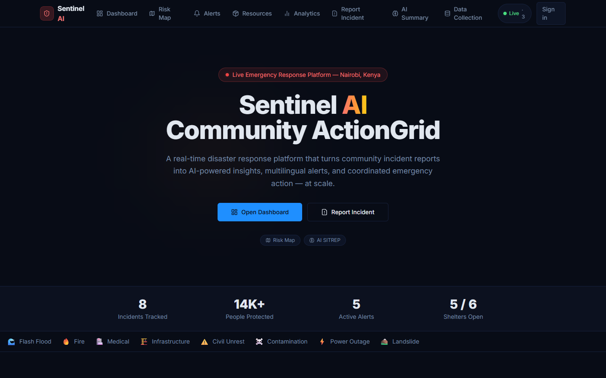

### Command Dashboard
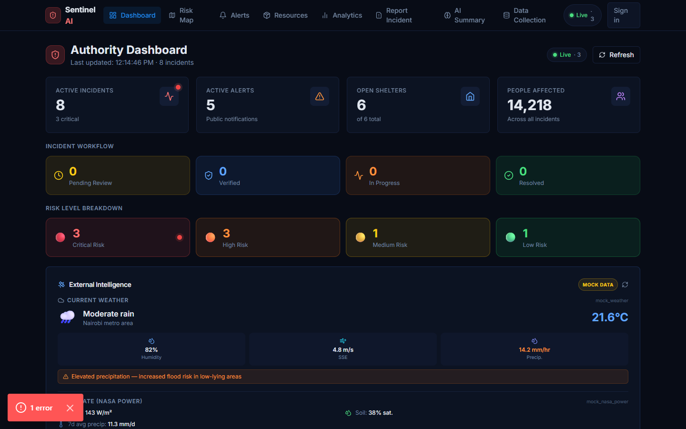

### Live Risk Map
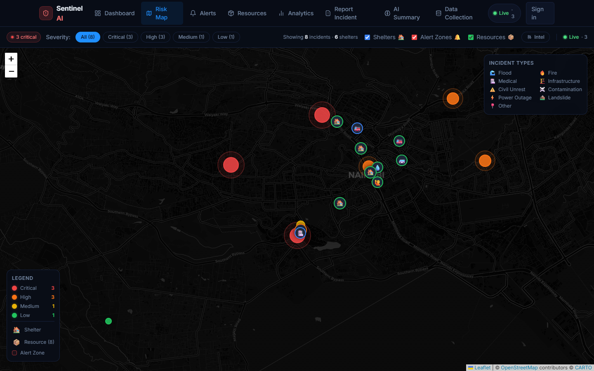

### Incident Submission Form
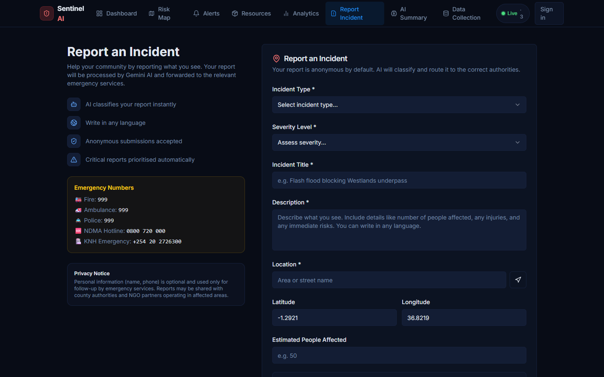

### AI Situation Report (SITREP)
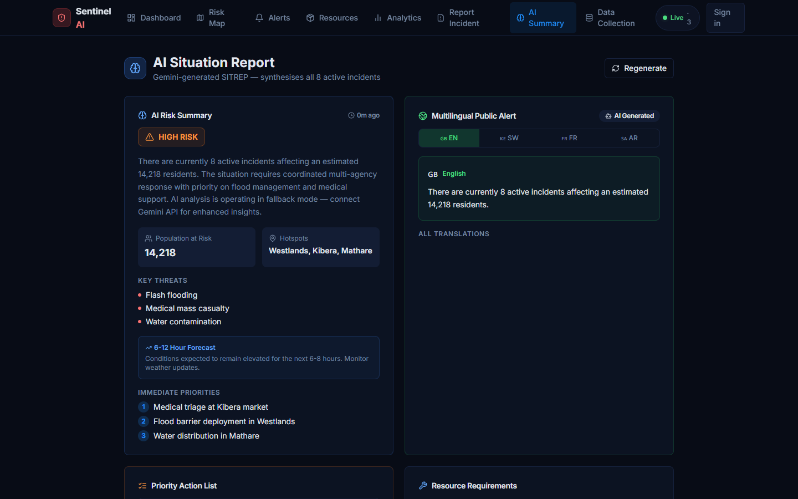

### Active Alerts
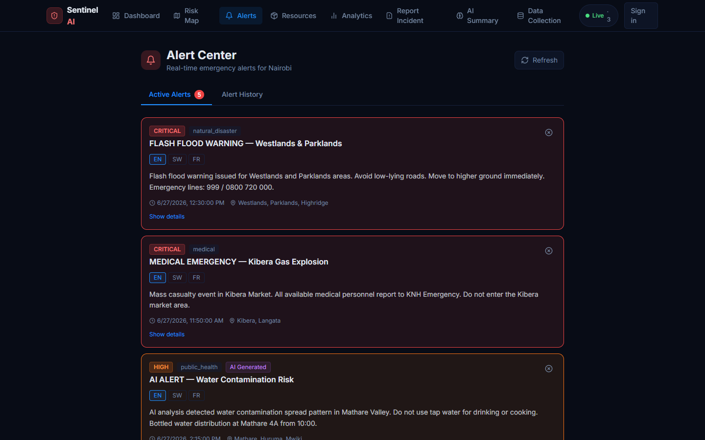

### Resources & Shelters
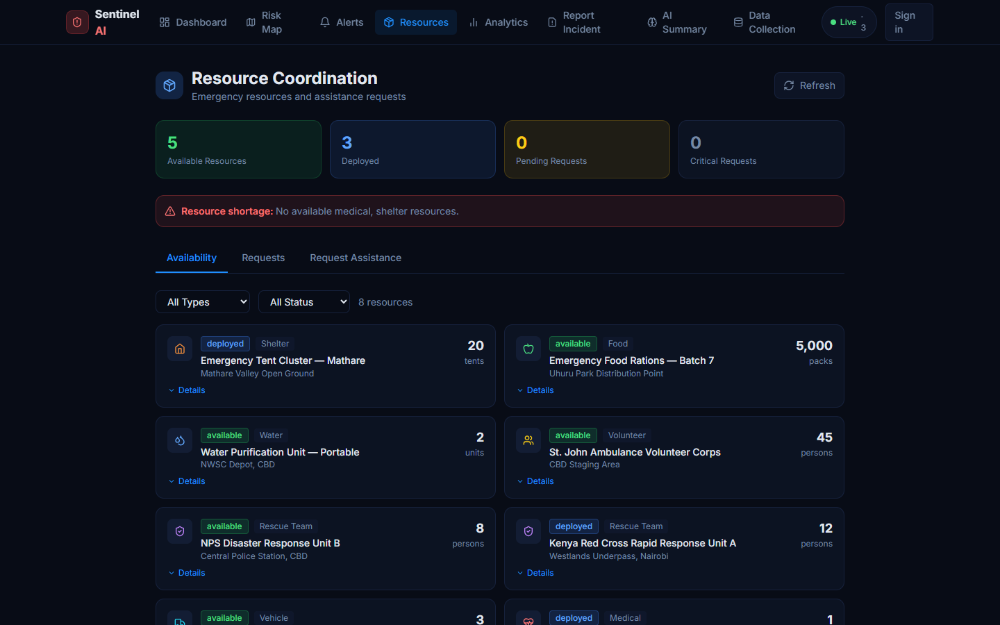

### Analytics Dashboard
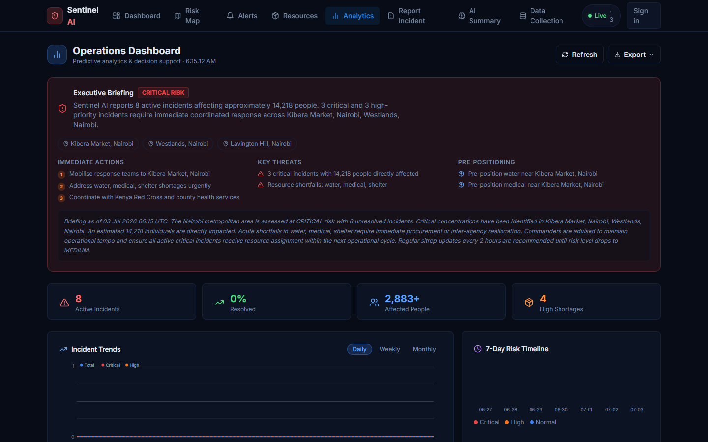

---

## Architecture

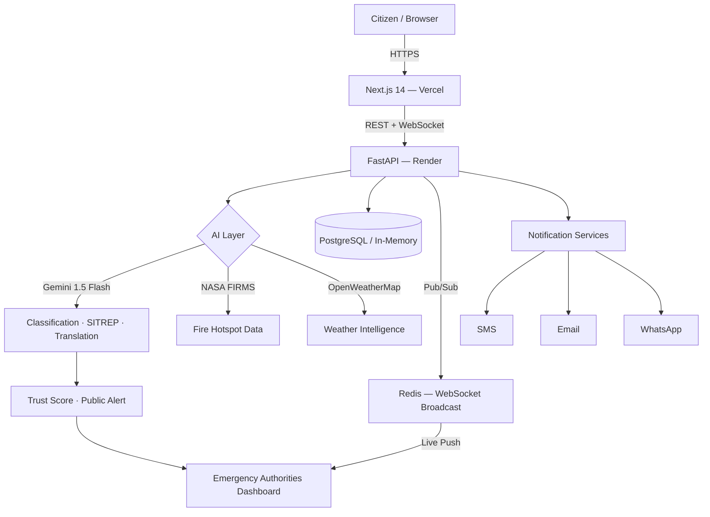

### Request Flow

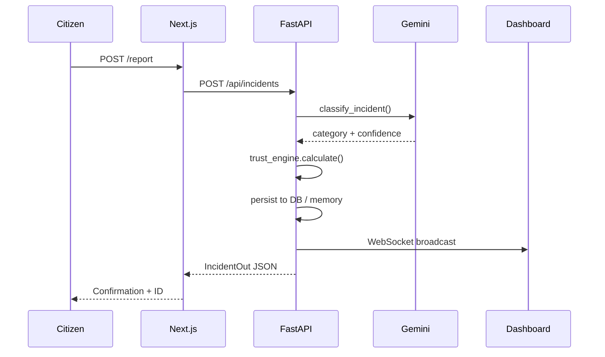

---

## Tech Stack

### Frontend

| Technology | Version | Purpose |
|---|---|---|
| Next.js | 14 (App Router) | SSR, routing, API routes |
| TypeScript | 5.x | Type safety |
| Tailwind CSS | 3.x | Utility-first styling |
| shadcn/ui | latest | Component library |
| NextAuth | v4 | Authentication + session management |
| Leaflet + react-leaflet | 1.9 / 4.x | Interactive risk maps |
| React Hook Form + Zod | 7.x / 3.x | Form validation |
| Prisma | 5.x | Optional user table ORM |
| Sonner | 1.x | Toast notifications |

### Backend

| Technology | Version | Purpose |
|---|---|---|
| FastAPI | 0.104+ | Async REST API + WebSocket |
| Pydantic v2 | 2.5+ | Schema validation |
| SQLAlchemy | 2.0 (async) | ORM — PostgreSQL |
| Alembic | 1.13+ | Database migrations |
| python-jose | 3.x | JWT signing (HS256) |
| bcrypt | 3.x | Password hashing |
| slowapi | 0.1.9 | Rate limiting |
| asyncpg | 0.29+ | Async PostgreSQL driver |

### AI & Intelligence

| Service | Purpose | Fallback |
|---|---|---|
| Google Gemini 1.5 Flash | Classification, SITREP, translation | Rich mock responses |
| OpenWeatherMap API | Real-time weather for trust scoring | Mock weather data |
| NASA FIRMS API | Satellite fire hotspot detection | Empty hotspot list |
| NASA POWER | Solar / climate data (free, no key) | Built-in |

### Deployment

| Layer | Platform |
|---|---|
| Frontend | Vercel (serverless, auto-deploy on push) |
| Backend | Render (web service, auto-deploy on push) |
| Database | PostgreSQL (Render / Neon / Supabase) or in-memory |
| WebSocket relay | Redis (optional — falls back to in-memory) |
| Container | Docker + docker-compose (local / self-hosted) |

---

## Folder Structure

```
sentinel-ai/
│
├── frontend/                        # Next.js 14 application
│   ├── src/
│   │   ├── app/                     # App Router pages
│   │   │   ├── (protected)/         # Route group — requires auth
│   │   │   │   ├── admin/           # Admin panel (ADMIN role)
│   │   │   │   │   ├── page.tsx     # Admin overview
│   │   │   │   │   ├── incidents/   # Incident management table
│   │   │   │   │   ├── resources/   # Resource management
│   │   │   │   │   └── ai-settings/ # AI model configuration
│   │   │   │   └── user-dashboard/  # Authenticated user home
│   │   │   ├── api/auth/            # NextAuth handler + register proxy
│   │   │   ├── auth/                # Login + register pages
│   │   │   ├── dashboard/           # Public command dashboard
│   │   │   ├── map/                 # Full-screen risk map
│   │   │   ├── report/              # Incident submission form
│   │   │   ├── ai-summary/          # Gemini SITREP view
│   │   │   ├── analytics/           # Analytics dashboard
│   │   │   ├── alerts/              # Public alert feed
│   │   │   └── resources/           # Resource browser
│   │   ├── components/
│   │   │   ├── dashboard/           # StatsCard, IncidentTable, AlertsFeed, RiskSummary
│   │   │   ├── map/                 # RiskMap (Leaflet — client-only)
│   │   │   ├── shared/              # Navbar, ShelterPanel
│   │   │   └── ui/                  # shadcn/ui primitives
│   │   ├── lib/
│   │   │   ├── auth.ts              # NextAuth config — delegates to FastAPI
│   │   │   ├── api.ts               # Typed API client with mock fallbacks
│   │   │   └── mock-data.ts         # Demo dataset (8 incidents, 4 alerts, 5 shelters)
│   │   ├── contexts/                # React context providers
│   │   ├── types/                   # Shared TypeScript interfaces
│   │   └── middleware.ts            # Route protection — withAuth
│   ├── prisma/                      # Prisma schema + migrations (optional)
│   ├── public/                      # Static assets, PWA manifest, service worker
│   └── scripts/                     # Build hooks
│
├── backend/                         # FastAPI application
│   └── app/
│       ├── main.py                  # Entry point — CORS, middleware, lifespan
│       ├── api/routes/
│       │   ├── auth.py              # Register + login + /me
│       │   ├── incidents.py         # Incidents CRUD + trust engine
│       │   ├── alerts.py            # Alert management
│       │   ├── resources.py         # Resources + shelters
│       │   ├── ai.py                # Gemini endpoints
│       │   ├── ai_settings.py       # AI provider config
│       │   ├── analytics.py         # Trends, hotspots, forecasting
│       │   ├── intelligence.py      # Weather + fire data
│       │   └── websocket.py         # Real-time WebSocket hub
│       ├── services/
│       │   ├── gemini_service.py    # Gemini calls + mock fallback
│       │   ├── trust_engine.py      # Multi-signal trust scoring
│       │   ├── analytics_service.py # Trend + forecast algorithms
│       │   ├── alert_engine.py      # Auto-alert generation
│       │   └── notification/        # SMS / Email / WhatsApp providers
│       ├── core/
│       │   ├── config.py            # Pydantic settings
│       │   ├── security.py          # JWT + bcrypt
│       │   ├── limiter.py           # slowapi rate limiter
│       │   └── connection_manager.py # WebSocket + Redis Pub/Sub
│       ├── db/
│       │   ├── database.py          # SQLAlchemy engine — dual-mode
│       │   ├── mock_data.py         # In-memory store + seed data
│       │   └── *_repo.py            # Repository layer per entity
│       ├── models/                  # SQLAlchemy ORM models
│       └── schemas/                 # Pydantic request/response schemas
│
├── sample_data/                     # Seed JSON (incidents, alerts, resources, shelters)
├── docker/
│   └── docker-compose.yml
├── render.yaml                      # Render deployment manifest
└── .env.example
```

---

## Installation

### Prerequisites

| Tool | Version |
|---|---|
| Node.js | 18+ |
| Python | 3.11+ |
| npm | latest |

A Gemini API key is optional — the platform runs in full demo mode without one.

### 1. Clone

```bash
git clone https://github.com/fokrulanthro16-eng/sentinel-ai.git
cd sentinel-ai
```

### 2. Backend

```bash
cd backend

python -m venv .venv

# Windows
.venv\Scripts\Activate.ps1
# macOS / Linux
source .venv/bin/activate

pip install -r requirements.txt

cp .env.example .env
# Set SECRET_KEY in .env

uvicorn app.main:app --reload --port 8000
```

Backend: http://localhost:8000 · Docs: http://localhost:8000/docs

### 3. Frontend

```bash
cd frontend
npm install
cp .env.local.example .env.local
# Set NEXTAUTH_SECRET in .env.local
npm run dev
```

App: http://localhost:3000

---

## Environment Variables

### Frontend (`frontend/.env.local`)

| Variable | Required | Description |
|---|---|---|
| `NEXTAUTH_SECRET` | **Yes** | Signs NextAuth JWTs. Generate: `openssl rand -base64 32` |
| `NEXTAUTH_URL` | **Yes** | Canonical URL. Local: `http://localhost:3000` · Prod: your Vercel URL |
| `NEXT_PUBLIC_API_URL` | No | FastAPI base URL. Defaults to Render URL in production |
| `NEXT_PUBLIC_MAP_CENTER_LAT` | No | Map latitude (default: `-1.2921` — Nairobi) |
| `NEXT_PUBLIC_MAP_CENTER_LNG` | No | Map longitude (default: `36.8219`) |
| `NEXT_PUBLIC_MAP_ZOOM` | No | Map zoom (default: `12`) |
| `DATABASE_URL` | No | PostgreSQL for Prisma user table — not required for auth |

### Backend (`backend/.env`)

| Variable | Required | Description |
|---|---|---|
| `SECRET_KEY` | **Yes** | Signs FastAPI JWTs. Generate: `openssl rand -hex 32` |
| `APP_ENV` | **Yes (prod)** | Set to `production` on Render |
| `DATABASE_URL` | No | PostgreSQL URL — omit for in-memory mock store |
| `GEMINI_API_KEY` | No | Google Gemini key — get free at [aistudio.google.com](https://aistudio.google.com) |
| `REDIS_URL` | No | Redis URL — omit for single-instance WebSocket |
| `CORS_ORIGINS` | No | Comma-separated allowed origins |
| `OPENWEATHER_API_KEY` | No | Weather data for trust scoring |
| `NASA_FIRMS_API_KEY` | No | Satellite fire hotspot data |
| `SMS_GATEWAY_URL` | No | SMS provider — omit for mock mode |
| `EMAIL_SMTP_HOST` | No | SMTP host for email alerts |
| `WHATSAPP_TOKEN` | No | WhatsApp Cloud API token |
| `WHATSAPP_PHONE_ID` | No | WhatsApp phone number ID |

---

## Authentication Flow

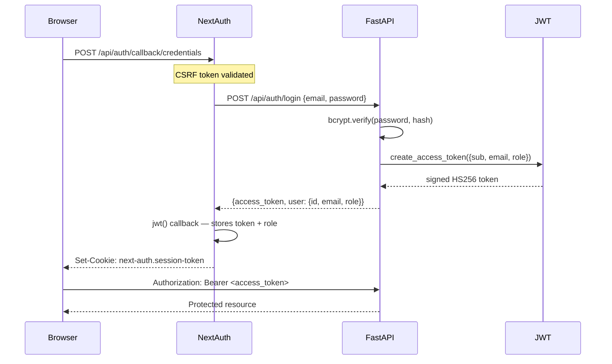

**Roles:**
- `USER` — `/user-dashboard`, incident submission, resource browser
- `ADMIN` — `/admin/*`, incident management, trust overrides, AI settings

---

## API Overview

Base URL: `https://sentinel-ai-2uo3.onrender.com` · Docs: `/docs`

<details>
<summary><strong>Auth</strong></summary>

| Method | Endpoint | Description |
|---|---|---|
| `POST` | `/api/auth/register` | Create account → JWT |
| `POST` | `/api/auth/login` | Authenticate → JWT |
| `GET` | `/api/auth/me` | Current user (Bearer token required) |

</details>

<details>
<summary><strong>Incidents</strong></summary>

| Method | Endpoint | Description |
|---|---|---|
| `GET` | `/api/incidents` | List — filter: `?severity=critical&status=active` |
| `POST` | `/api/incidents` | Submit → AI classification + trust score |
| `GET` | `/api/incidents/{id}` | Single incident |
| `PATCH` | `/api/incidents/{id}/status` | Update status |
| `GET` | `/api/incidents/{id}/trust` | Trust score + validation reasons |
| `POST` | `/api/incidents/{id}/trust/recalculate` | Re-run with live intelligence data |
| `PATCH` | `/api/incidents/{id}/trust/override` | Admin trust override |
| `GET` | `/api/incidents/{id}/audit` | Full audit trail |
| `GET` | `/api/incidents/analytics` | Aggregate stats |

</details>

<details>
<summary><strong>Alerts</strong></summary>

| Method | Endpoint | Description |
|---|---|---|
| `GET` | `/api/alerts` | Active public alerts |
| `POST` | `/api/alerts` | Create alert — auto-translates to SW/FR/AR |
| `PATCH` | `/api/alerts/{id}` | Update alert |

</details>

<details>
<summary><strong>Resources</strong></summary>

| Method | Endpoint | Description |
|---|---|---|
| `GET` | `/api/resources` | All shelters and resources |
| `GET` | `/api/resources/nearest` | Nearest `?lat=-1.29&lng=36.82&limit=3` |
| `POST` | `/api/resources` | Add resource |
| `PATCH` | `/api/resources/{id}` | Update capacity / status |

</details>

<details>
<summary><strong>AI</strong></summary>

| Method | Endpoint | Description |
|---|---|---|
| `POST` | `/api/ai/classify` | Free-text → category + severity + confidence |
| `GET` | `/api/ai/risk-summary` | Full SITREP |
| `POST` | `/api/ai/multilingual-alert` | Translate to SW / FR / AR |
| `POST` | `/api/ai/recommend` | Prioritised action list |

</details>

<details>
<summary><strong>Analytics</strong></summary>

| Method | Endpoint | Description |
|---|---|---|
| `GET` | `/api/analytics/trends` | Incident counts by period |
| `GET` | `/api/analytics/hotspots` | Geographic incident clusters |
| `GET` | `/api/analytics/resource-forecast` | Demand vs. available |
| `GET` | `/api/analytics/shelter-forecast` | Occupancy forecast |
| `GET` | `/api/analytics/response-time` | MTTR / MTTV per category |
| `GET` | `/api/analytics/risk-timeline` | Rolling risk score (3–30 days) |
| `GET` | `/api/analytics/briefing` | AI executive briefing |

</details>

---

## AI Workflow

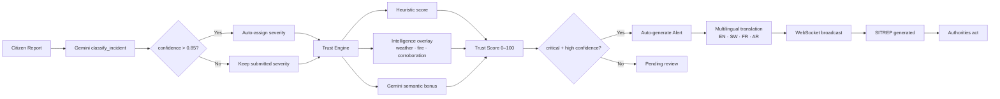

---

## Security

| Control | Implementation |
|---|---|
| Password hashing | bcrypt cost-12 |
| JWT (backend) | HS256, python-jose, 7-day expiry |
| JWT (frontend) | NextAuth HttpOnly cookie, SameSite=Lax |
| CSRF | NextAuth double-submit token |
| CORS | FastAPI explicit allowlist + Vercel preview regex |
| Rate limiting | slowapi — 5 req/min register, 10 req/min login |
| Input validation | Pydantic v2 strict mode |
| Secrets | Never committed — Vercel / Render env dashboards only |
| Production guard | Backend exits if `SECRET_KEY` is default and `APP_ENV=production` |

---

## Performance

- **FastAPI** async I/O — all DB and HTTP calls are non-blocking
- **Next.js** App Router with React Server Components; served from Vercel Edge CDN
- **WebSocket** Redis Pub/Sub allows horizontal backend scaling
- **Gemini** calls are parallel where possible; mock fallback adds zero latency
- **Leaflet** markers lazy-clustered; tiles from CartoDB CDN

---

## Roadmap

- [ ] Mobile PWA — offline incident submission (service worker already ships)
- [ ] Web Push notifications for authority alerts
- [ ] Geofencing — auto-notify citizens within affected radius
- [ ] Multi-city — configurable map center per deployment
- [ ] Image evidence — photo upload with Gemini vision analysis
- [ ] PostgreSQL persistence — survive Render restarts without re-registration
- [ ] Responder role — field responder assignment queue
- [ ] SLA tracking — escalation rules on unverified critical incidents
- [ ] Two-factor auth — TOTP for authority accounts
- [ ] Audit log export — PDF/CSV per incident

---

## Demo Credentials

| Role | Email | Password |
|---|---|---|
| Admin | `admin@gmail.com` | `Admin@123` |

Register any email at `/auth/register` for a USER account.

> Admin is re-seeded on every Render restart. Registered users persist only until the next restart unless `DATABASE_URL` is set.

---

## Contributors

<table>
  <tr>
    <td align="center">
      <a href="https://github.com/fokrulanthro16-eng">
        <br/>
        <sub><b>Fokrul</b></sub>
      </a><br/>
      <sub>Creator &amp; Maintainer</sub>
    </td>
  </tr>
</table>

Contributions welcome. Open an issue or submit a pull request against `main`.

---

## License

MIT &copy; 2024 Fokrul. See [LICENSE](LICENSE) for details.

---

<div align="center">
Built for humanity. Powered by AI. Deployed for real emergencies.<br/>
<a href="https://sentinel-ai-six-omega.vercel.app">sentinel-ai-six-omega.vercel.app</a>
</div>
